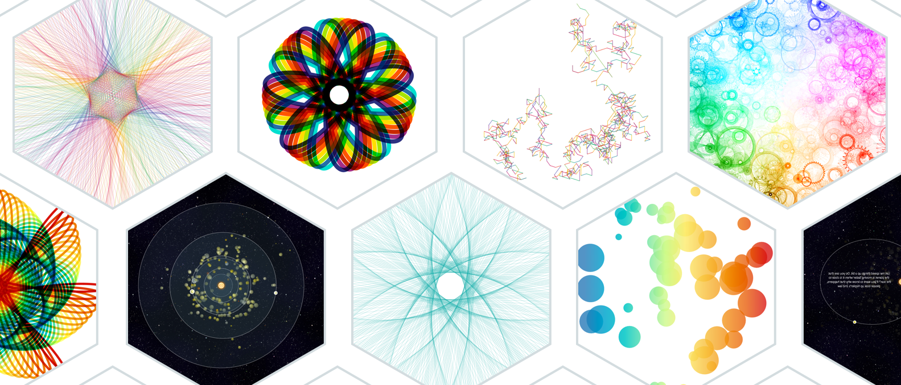

#Fresh data shapes
##### A 3-minute look into visualizing the beauty of math

In this repo you can find the slides and underlying code for the elevator pitch that I gave at Reasons to in Brighton on September 6th, 2016. It might take a few seconds to load, but you should see something within ±10 seconds. Note that the presentation has a few CPU heavy slides, especially those with continuously moving objects

####Please, please look at these slides in Chrome - Will look horrible on mobile (and probably crash)

Tested with Chrome, Firefox and Safari. Definitely meant to be seen in Chrome. Even more so at a resolution of 1920x1080

[Fresh data shapes](https://nbremer.github.io/freshdatashapes/)

#####Notes

- The "hexagon-showcase" slide: The first slide with the hexagon and moving circles. Once you press next once it rotates to a different visual form every 3 seconds (until the one after the one with a black background :) )
- The "exo-planets" slide: After the first next it will move through several fragments until you see a very elliptical orbit
- The "guilloche" slide: After the first next and you have seen the light blue spirograph turn into a star formed something, if you press next again it will go through ±5 more images automatically

There are also some animations that might take a second or so to start running after pressing the next arrow :)

If you're looking at the presentation at a different resolution than 1920x1080 the text has the tendency to twitch whenever you click on the next arrow and an animation occurs within the same slide. Not sure why this is...

The slides are meant to be viewed in a forward direction. I tried to make all slides work while you click back as well, but there might be some things that don't run quite right.

Some slides automatically run through a set of animations after a certain number of "next" key presses:

If, for whatever strange reason, you don't want to use Chrome, here are some quirks with other browsers:

- Safari can't handle the exoplanets moving, so I turned off the rotation in Safari. You'll just see a row of planets not doing anything...
- It also seems that Safari can't handle the moving slider in the "hexagon-showcase", so I've deactivated the slider movement for Safari
- Never checked in IE, I'm guessing it would just be too horrible to look at...

Inside the slides folder you'll see another layer of folders. Here each slide has gotten its own folder, but the numbering is based on the order in which I made them and not on the order on which they appear on the screen (this you can find in the index.html file).

I've used the code developed by [ptamarit](https://github.com/hakimel/reveal.js/issues/456) to use D3 (and D3 transitions) in RevealJS slides 

Strange useless fact - I've found that the song Running by Moderat is a perfect companion for the first state of the exo-planets slide. The orbits are shown in the same beat as the song :)
